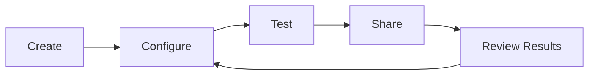

# Creating Scenarios

A scenario is the core unit of Waterr Meet -- it defines the entire conversation experience, from who the AI is to how participants get evaluated.

## Scenario Types

| Type | Use Case |
|------|----------|
| Interview | Behavioral, technical, or HR interviews |
| Sales | Discovery calls, demos, objection handling |
| Training | Onboarding, skill development, coaching |
| Support | Customer service, escalation handling |
| Product | User research, feedback collection, onboarding |
| Marketing | Testimonial collection, brand voice practice |

## Scenario Lifecycle



1. **Create** -- Generate with AI or start from a template
2. **Configure** -- Edit persona, instructions, goals, and settings
3. **Test** -- Use the Playground to verify behavior
4. **Share** -- Distribute via link, embed, or schedule
5. **Review** -- Analyze responses, iterate on the scenario

---

## AI-Generated (Recommended)

The fastest way to create a scenario is to describe what you need in plain language.

<Steps>
  <Step title="Open the Creator">
    Click **Create** in the sidebar navigation.
  </Step>
  <Step title="Describe your scenario">
    Type a prompt in the chat box. Be specific about:
    - Who the AI should be (role, demeanor)
    - What the conversation should accomplish
    - Who the participant is (context)
    
    Example prompts:
    ```text
    You need to conduct a behavioral interview to assess 
    problem-solving skills for a senior engineer role.
    ```
    ```text
    You need to run a sales discovery call with a skeptical 
    CFO who has budget concerns about switching vendors.
    ```
  </Step>
  <Step title="Add context (optional)">
    - **Attach a file**: Upload a resume, job description, or product brief
    - **Set duration**: Click the clock icon or mention it in your prompt ("15 minutes")
    - **Enable features**: Toggle live vision or web search if relevant
  </Step>
  <Step title="Generate">
    Click send. The AI creates a complete scenario with persona, instructions, and goals. You'll be taken to the scenario detail page to review and customize.
  </Step>
</Steps>

<Tip>
The more specific your prompt, the better the output. "Run a sales call" produces generic results. "Run a discovery call with a VP of Operations at a 500-person logistics company evaluating warehouse automation" produces something realistic.
</Tip>

## From a Template

Templates are pre-built scenarios you can use as starting points.

<Steps>
  <Step title="Browse templates">
    Click **Templates** in the sidebar. Browse by category: Sales, GTM Training, Interview, Support, Product, Marketing.
  </Step>
  <Step title="Select a template">
    Click any template card to preview it. If it fits your use case, click **Use Template**.
  </Step>
  <Step title="Customize">
    The template creates a scenario with pre-filled persona, instructions, and goals. Edit any of these to match your specific needs.
  </Step>
</Steps>

## Available Templates

| Template | Category | Description |
|----------|----------|-------------|
| Sales Discovery Call | Sales | Practice qualifying leads and uncovering pain points |
| GTM Strategy Workshop | Training | Facilitate go-to-market planning sessions |
| Behavioral Interview | Interview | Assess soft skills with STAR-method questions |
| HR Culture Fit Interview | Interview | Evaluate cultural alignment and values |
| SDE Technical Interview | Interview | System design and coding discussion |
| AI/ML Engineer Interview | Interview | Machine learning concepts and architecture |
| On-Screen IT Support | Support | Walk users through technical issues |
| Product Onboarding | Product | Guide new users through features |
| Product Feedback Session | Product | Collect structured user feedback |
| Testimonial Collection | Marketing | Guide customers through giving testimonials |

## What's in a Scenario

Every scenario has four configurable layers:

<CardGroup cols={2}>
  <Card title="Persona" icon="user" href="/getting-started/personas">
    Who the AI pretends to be during the conversation.
  </Card>
  <Card title="Meeting Script" icon="wand-magic-sparkles" href="/customization/meeting-script">
    The instructions that drive AI behavior.
  </Card>
  <Card title="Evaluations" icon="bullseye" href="/customization/post-meeting-evaluations">
    What gets measured and scored after the session.
  </Card>
  <Card title="Settings" icon="gear" href="/customization/participant-experience">
    Duration, recording, controls, and integrations.
  </Card>
</CardGroup>
