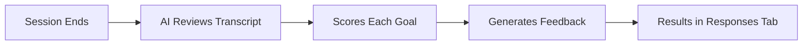

Goals are the criteria the AI uses to evaluate participants after each session. They turn every conversation into measurable, actionable feedback.

## How It Works

1. A participant completes a session
2. The AI reads the full transcript
3. It evaluates performance against each goal's scoring criteria
4. It produces a score and written feedback per goal
5. Results appear in the Responses tab

## Goal Structure

Each goal has three components:

| Component | Purpose | Example |
|-----------|---------|---------|
| Name | What you're measuring | "Objection Handling" |
| Description | Context about the goal | "Ability to address buyer concerns" |
| Scoring Instructions | Detailed evaluation criteria | "Score high if participant acknowledged the objection, asked clarifying questions, and provided evidence-based counter-arguments" |

## When to Use Goals

- **Interviews**: Evaluate communication skills, technical knowledge, problem-solving approach
- **Sales Training**: Measure discovery quality, objection handling, closing technique
- **Support**: Assess empathy, resolution speed, escalation judgment
- **Onboarding**: Check understanding, engagement, question quality

<Info>
Goals are invisible to participants. They interact naturally with the AI persona -- scoring happens after the session ends.
</Info>
