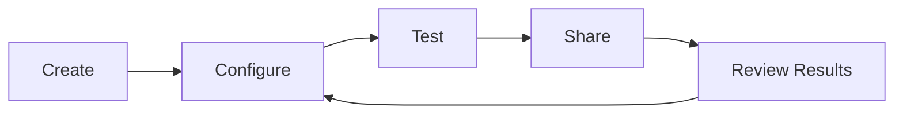

# Scenarios

A scenario is an AI-powered conversation session. It's the core unit of Waterr AI -- everything you build starts with a scenario.

## Scenario Types

Scenarios can serve different purposes. The type you choose affects template suggestions and default settings:

| Type | Use Case |
|------|----------|
| Interview | Behavioral, technical, or HR interviews |
| Sales | Discovery calls, demos, objection handling |
| Training | Onboarding, skill development, coaching |
| Support | Customer service, escalation handling |
| Product | User research, feedback collection, onboarding |
| Marketing | Testimonial collection, brand voice practice |

## Scenario Lifecycle

1. **Create** -- Generate with AI or start from a template
2. **Configure** -- Edit persona, instructions, goals, and settings
3. **Test** -- Use the Playground to verify behavior
4. **Share** -- Distribute via link, embed, or schedule
5. **Review** -- Analyze responses, iterate on the scenario

## What's in a Scenario

Every scenario has four configurable layers:

<CardGroup cols={2}>
  <Card title="Persona" icon="user" href="/scenarios/personas">
    Who the AI pretends to be during the conversation.
  </Card>
  <Card title="Instructions" icon="wand-magic-sparkles" href="/scenarios/instructions">
    The system prompt that drives AI behavior.
  </Card>
  <Card title="Goals" icon="bullseye" href="/goals/overview">
    What gets measured and scored after the session.
  </Card>
  <Card title="Settings" icon="gear" href="/scenarios/managing#settings">
    Duration, recording, consent, and integrations.
  </Card>
</CardGroup>
